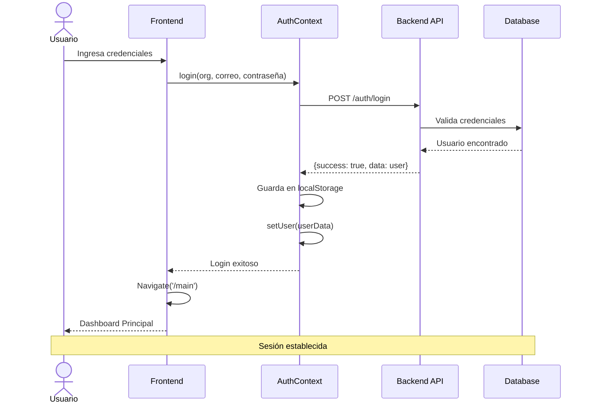
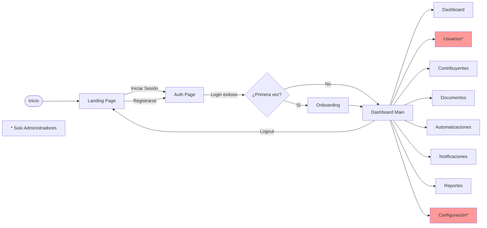
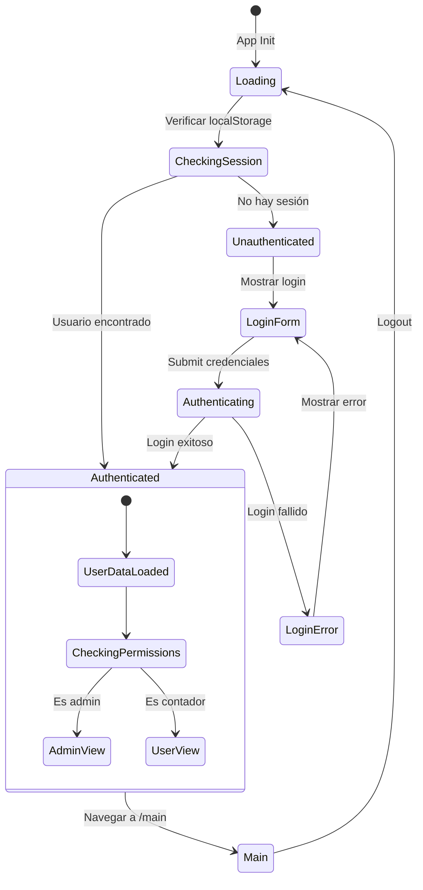
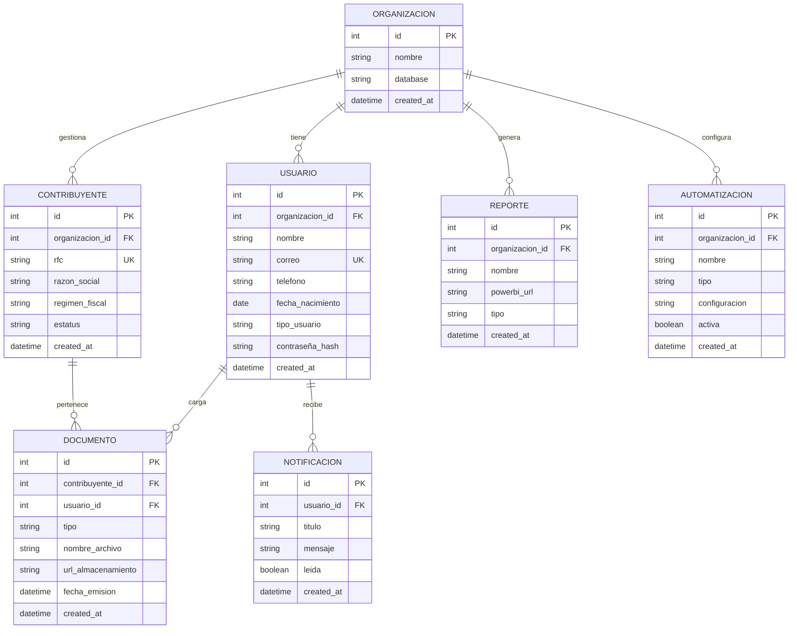
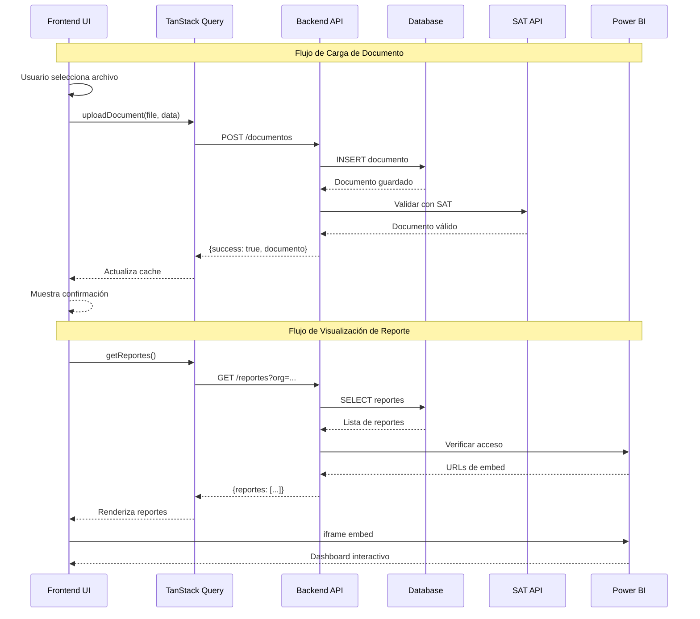
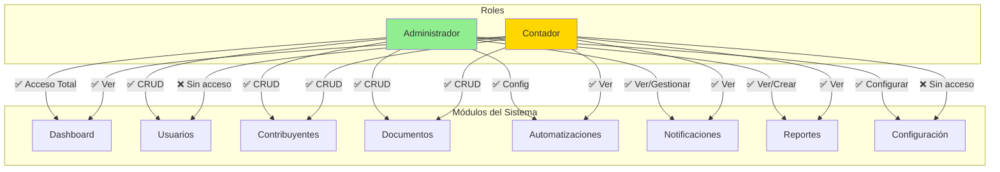
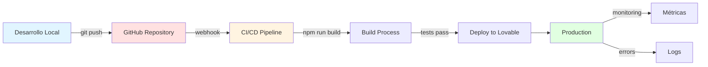
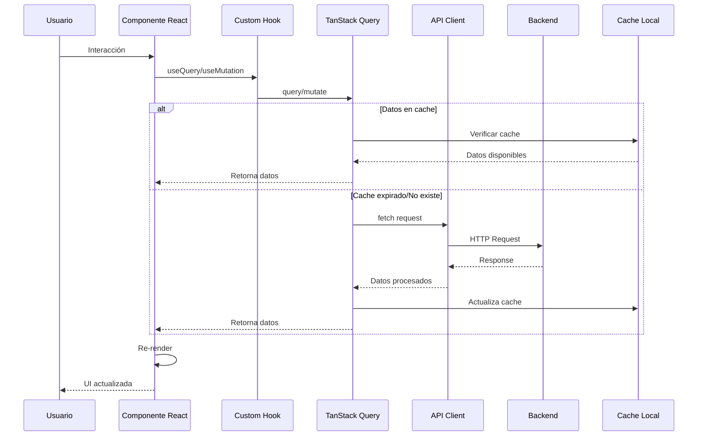
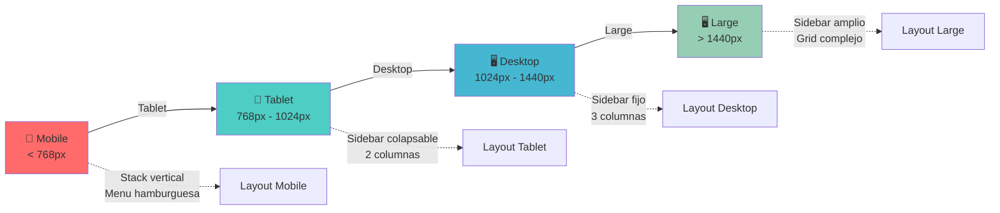
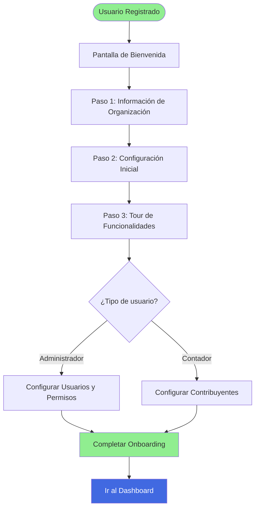

# 📐 Diagramas del Sistema - Fiscal Nexus Pro

## 🏗️ Arquitectura General del Sistema

```mermaid
graph TB
    subgraph "Frontend - React + Vite"
        UI[Interface de Usuario]
        Router[React Router]
        Auth[AuthContext]
        Query[TanStack Query]
        
        UI --> Router
        UI --> Auth
        UI --> Query
    end
    
    subgraph "Páginas"
        Landing[Landing Page]
        Login[Autenticación]
        Onboard[Onboarding]
        Dashboard[Dashboard Principal]
        
        Router --> Landing
        Router --> Login
        Router --> Onboard
        Router --> Dashboard
    end
    
    subgraph "Backend API"
        API[API REST]
        AuthAPI[Auth Endpoints]
        DataAPI[Data Endpoints]
        
        API --> AuthAPI
        API --> DataAPI
    end
    
    subgraph "Base de Datos"
        DB[(Database Multi-tenant)]
        Org1[(Org 1 Schema)]
        Org2[(Org 2 Schema)]
        OrgN[(Org N Schema)]
        
        DB --> Org1
        DB --> Org2
        DB --> OrgN
    end
    
    subgraph "Servicios Externos"
        PowerBI[Power BI]
        SAT[SAT API]
    end
    
    Query -.HTTP.-> API
    AuthAPI -.-> DB
    DataAPI -.-> DB
    Dashboard -.-> PowerBI
    DataAPI -.-> SAT
    
    style Frontend fill:#e1f5ff
    style Backend fill:#ffe1e1
    style "Base de Datos" fill:#e1ffe1
    style "Servicios Externos" fill:#fff4e1
```

## 🔐 Flujo de Autenticación



## 🗺️ Mapa de Navegación



## 🎯 Arquitectura de Componentes

```mermaid
graph TB
    subgraph "App.tsx - Root"
        App[App Component]
        Providers[Providers Setup]
        
        App --> Providers
    end
    
    subgraph "Providers"
        QueryProvider[QueryClientProvider]
        TooltipProvider[TooltipProvider]
        BrowserRouter[BrowserRouter]
        AuthProvider[AuthProvider]
        
        Providers --> QueryProvider
        Providers --> TooltipProvider
        Providers --> BrowserRouter
        Providers --> AuthProvider
    end
    
    subgraph "Routes"
        Routes[Routes Config]
        Index[/ - Index]
        AuthRoute[/auth - Auth]
        OnboardRoute[/onboarding - Onboarding]
        MainRoute[/main - Main]
        NotFoundRoute[/* - NotFound]
        
        BrowserRouter --> Routes
        Routes --> Index
        Routes --> AuthRoute
        Routes --> OnboardRoute
        Routes --> MainRoute
        Routes --> NotFoundRoute
    end
    
    subgraph "Main Dashboard Structure"
        MainComp[Main Component]
        Sidebar[Sidebar Navigation]
        Content[Content Area]
        
        MainRoute --> MainComp
        MainComp --> Sidebar
        MainComp --> Content
    end
    
    subgraph "Dashboard Sections"
        DashSec[DashboardSection]
        UsersSec[UsersSection]
        ContribSec[ContributorsSection]
        DocsSec[DocumentsSection]
        AutoSec[AutomationsSection]
        NotifSec[NotificationsSection]
        PowerSec[PowerBISection]
        SettSec[SettingsSection]
        
        Content --> DashSec
        Content --> UsersSec
        Content --> ContribSec
        Content --> DocsSec
        Content --> AutoSec
        Content --> NotifSec
        Content --> PowerSec
        Content --> SettSec
    end
    
    style Providers fill:#e1f5ff
    style Routes fill:#ffe1e1
    style "Main Dashboard Structure" fill:#e1ffe1
    style "Dashboard Sections" fill:#fff4e1
```

## 🔄 Flujo de Estado de Autenticación



## 📊 Modelo de Datos



## 🔌 Diagrama de Integración de API



## 🎨 Estructura de Componentes UI

```mermaid
graph TB
    subgraph "Layout Components"
        Header[Header]
        Sidebar[Sidebar]
        Footer[Footer]
    end
    
    subgraph "Feature Components"
        Hero[Hero]
        Features[Features]
        Pricing[Pricing]
        FileUpload[FileUpload]
        PaymentForm[PaymentForm]
        UserManagement[UserManagement]
    end
    
    subgraph "Base UI Components - shadcn/ui"
        Button[Button]
        Card[Card]
        Dialog[Dialog]
        Form[Form]
        Table[Table]
        Input[Input]
        Select[Select]
        Toast[Toast]
        Badge[Badge]
        Tabs[Tabs]
        etc[... +30 componentes]
    end
    
    Header -.usa.-> Button
    Header -.usa.-> Dialog
    
    FileUpload -.usa.-> Button
    FileUpload -.usa.-> Card
    FileUpload -.usa.-> Badge
    
    PaymentForm -.usa.-> Form
    PaymentForm -.usa.-> Input
    PaymentForm -.usa.-> Button
    
    UserManagement -.usa.-> Table
    UserManagement -.usa.-> Dialog
    UserManagement -.usa.-> Form
    
    style "Layout Components" fill:#e1f5ff
    style "Feature Components" fill:#ffe1e1
    style "Base UI Components - shadcn/ui" fill:#e1ffe1
```

## 🔐 Matriz de Permisos



## 🚀 Flujo de Deployment



## 🔄 Ciclo de Vida de una Petición



## 📱 Responsive Design Breakpoints



## 🎯 Flujo de Onboarding



---

## 📝 Notas sobre los Diagramas

### Herramientas Utilizadas
- **Mermaid** - Todos los diagramas están en formato Mermaid para fácil visualización en GitHub y editores compatibles

### Cómo Visualizar
1. **GitHub**: Los diagramas se renderizan automáticamente
2. **VS Code**: Instalar extensión "Markdown Preview Mermaid Support"
3. **Online**: Usar [Mermaid Live Editor](https://mermaid.live/)

### Actualización
Estos diagramas deben actualizarse cuando:
- Se agreguen nuevos módulos
- Cambien los flujos de autenticación
- Se modifique la arquitectura
- Se añadan nuevas integraciones

---

**Versión:** 1.0  
**Última actualización:** Enero 2026  
**Autor:** Victor117-byte
