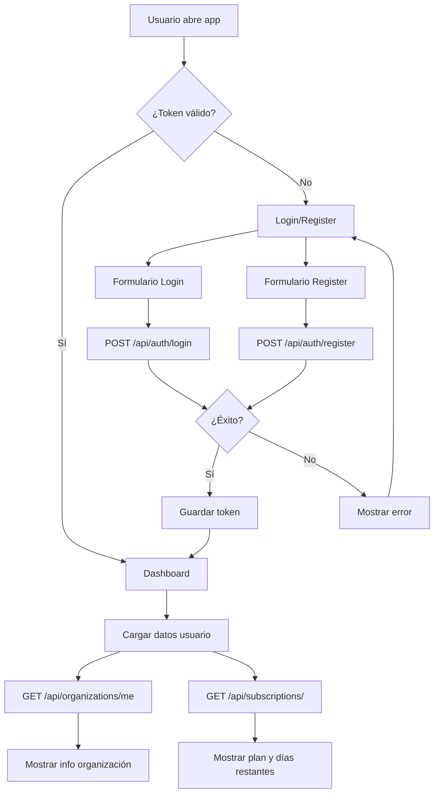

# 🎨 Frontend Flow Diagram

Diagramas de flujo para implementar en el frontend.

## 📋 Flujo Principal



## 🔐 Flujo de Autenticación

```
┌─────────────┐
│   INICIO    │
└──────┬──────┘
       │
       v
┌─────────────────────┐
│ Página Login        │
│                     │
│ [Email]             │
│ [Password]          │
│ [Botón Login]       │
│ [Link Register]     │
└──────┬──────────────┘
       │ Usuario hace clic en Login
       v
┌─────────────────────┐
│ Validar datos       │
│ - Email válido?     │
│ - Password no vacío?│
└──────┬──────────────┘
       │ ✓ Válido
       v
┌──────────────────────────────┐
│ POST /api/auth/login         │
│                              │
│ Content-Type:                │
│ application/x-www-form-      │
│ urlencoded                   │
│                              │
│ Body:                        │
│ username=email@example.com   │
│ password=pass                │
│                              │
│ ⚠️ Campo 'username' usa EMAIL│
└──────┬───────────────────────┘
       │
       v
    ┌──┴──┐
    │¿200?│
    └──┬──┘
       │
   ┌───┴───┐
   │       │
   v       v
  200     401
   │       │
   │       └──> Mostrar error "Credenciales incorrectas"
   │
   v
┌──────────────────────────┐
│ Guardar en localStorage: │
│ - auth_token             │
│ - user (JSON)            │
└──────┬───────────────────┘
       │
       v
┌──────────────────────┐
│ Redirigir a Dashboard│
└──────────────────────┘
```

## 📄 Flujo de Documentos

```
┌────────────────┐
│   DASHBOARD    │
└────────┬───────┘
         │
         v
┌────────────────────────┐
│ Botón "Subir Documento"│
└────────┬───────────────┘
         │
         v
┌──────────────────────────────┐
│ Modal Upload                 │
│                              │
│ [Seleccionar archivo]        │
│ [Input: Nombre cliente]      │
│ [Botón: Subir]              │
└────────┬─────────────────────┘
         │ Usuario selecciona archivo
         v
┌──────────────────────────┐
│ Validar archivo          │
│ - Tamaño < 10MB?         │
│ - Tipo permitido?        │
└────────┬─────────────────┘
         │ ✓ Válido
         v
┌─────────────────────────────┐
│ Crear FormData              │
│ formData.append('file', ..) │
│ formData.append('cliente',..)│
└────────┬────────────────────┘
         │
         v
┌──────────────────────────────────┐
│ POST /api/documents/upload       │
│                                  │
│ Headers:                         │
│   Authorization: Bearer {token}  │
│                                  │
│ Body: FormData                   │
└────────┬─────────────────────────┘
         │
         v
      ┌──┴──┐
      │¿200?│
      └──┬──┘
         │
     ┌───┴───┐
     │       │
     v       v
    200     Error
     │       │
     │       └──> Mostrar error
     │
     v
┌────────────────────────┐
│ Mostrar éxito          │
│ "Documento subido"     │
└────────┬───────────────┘
         │
         v
┌────────────────────────┐
│ Recargar lista docs    │
│ GET /api/documents/    │
└────────────────────────┘
```

## 📊 Flujo de Lista de Documentos

```
┌──────────────────┐
│ Página Documentos│
└────────┬─────────┘
         │
         v
┌─────────────────────────────┐
│ useEffect(() => {           │
│   loadDocuments()           │
│ }, [page])                  │
└────────┬────────────────────┘
         │
         v
┌──────────────────────────────────────┐
│ GET /api/documents/?page=1&per_page=10│
│                                       │
│ Headers:                              │
│   Authorization: Bearer {token}       │
└────────┬──────────────────────────────┘
         │
         v
┌────────────────────────────────┐
│ Response:                      │
│ {                              │
│   data: {                      │
│     documents: [...],          │
│     total: 50,                 │
│     page: 1,                   │
│     per_page: 10               │
│   }                            │
│ }                              │
└────────┬───────────────────────┘
         │
         v
┌────────────────────────────────┐
│ Renderizar tabla               │
│                                │
│ ┌────┬──────────┬────────────┐ │
│ │ ID │ Nombre   │ Cliente    │ │
│ ├────┼──────────┼────────────┤ │
│ │ 1  │ doc1.pdf │ Cliente A  │ │
│ │ 2  │ doc2.pdf │ Cliente B  │ │
│ └────┴──────────┴────────────┘ │
│                                │
│ [<< Anterior] Pág 1 [Siguiente >>]│
└────────────────────────────────┘
```

## 🔄 Flujo de Verificación de Suscripción

```
┌──────────────┐
│  CUALQUIER   │
│   PÁGINA     │
└──────┬───────┘
       │
       v
┌──────────────────────────┐
│ useEffect(() => {        │
│   checkSubscription()    │
│ }, [])                   │
└──────┬───────────────────┘
       │
       v
┌─────────────────────────────┐
│ GET /api/subscriptions/     │
│                             │
│ Headers:                    │
│   Authorization: Bearer {...}│
└──────┬──────────────────────┘
       │
       v
┌──────────────────────────────┐
│ Response:                    │
│ {                            │
│   plan: "free",              │
│   status: "trialing",        │
│   days_remaining: 25         │
│ }                            │
└──────┬───────────────────────┘
       │
       v
    ┌──┴───────┐
    │ Status?  │
    └──┬───────┘
       │
   ┌───┴────────────┐
   │                │
   v                v
trialing/active   expired
   │                │
   │                └──> Mostrar banner
   │                    "Suscripción expirada"
   │                    "Renovar ahora"
   │
   v
┌──────────────────────────┐
│ Mostrar en UI:           │
│                          │
│ ┌────────────────────┐   │
│ │ Plan: FREE         │   │
│ │ 📅 25 días restantes│   │
│ │ [Actualizar]       │   │
│ └────────────────────┘   │
└──────────────────────────┘
```

## 🚪 Flujo de Logout

```
┌──────────────┐
│  Dashboard   │
│              │
│ [Botón Salir]│
└──────┬───────┘
       │ Usuario hace clic
       v
┌──────────────────────────┐
│ function logout() {      │
│   localStorage.remove    │
│     ('auth_token')       │
│   localStorage.remove    │
│     ('user')             │
│ }                        │
└──────┬───────────────────┘
       │
       v
┌──────────────────────────┐
│ window.location.href =   │
│   '/login'               │
└──────────────────────────┘
```

## 🔐 Flujo de Token Expirado

```
┌─────────────────┐
│  Cualquier      │
│  Request        │
└────────┬────────┘
         │
         v
┌────────────────────────┐
│ fetch('/api/...')      │
│ Headers: {             │
│   Authorization: ...   │
│ }                      │
└────────┬───────────────┘
         │
         v
      ┌──┴───┐
      │ 401? │
      └──┬───┘
         │
     ┌───┴────┐
     │        │
     v        v
    No      Sí (Token expirado)
     │        │
     │        └──> localStorage.removeItem('auth_token')
     │        │
     │        └──> window.location.href = '/login'
     │        │
     │        └──> Mostrar: "Sesión expirada"
     │
     v
Procesar respuesta normal
```

## 📱 Estados de la Aplicación

```
┌─────────────────────────────────────┐
│         ESTADOS GLOBALES            │
├─────────────────────────────────────┤
│                                     │
│  user: {                            │
│    id, email, full_name,            │
│    role, company                    │
│  }                                  │
│                                     │
│  token: "eyJhbGc..."                │
│                                     │
│  subscription: {                    │
│    plan, status, days_remaining     │
│  }                                  │
│                                     │
│  documents: [...]                   │
│                                     │
│  loading: boolean                   │
│                                     │
│  error: string | null               │
│                                     │
└─────────────────────────────────────┘
```

## 🎯 Componentes Recomendados

```
src/
├── components/
│   ├── Auth/
│   │   ├── LoginForm.jsx
│   │   ├── RegisterForm.jsx
│   │   └── PrivateRoute.jsx
│   │
│   ├── Documents/
│   │   ├── DocumentUpload.jsx
│   │   ├── DocumentList.jsx
│   │   ├── DocumentCard.jsx
│   │   └── DocumentFilter.jsx
│   │
│   ├── Dashboard/
│   │   ├── StatCards.jsx
│   │   ├── RecentDocuments.jsx
│   │   └── SubscriptionBanner.jsx
│   │
│   └── Layout/
│       ├── Navbar.jsx
│       ├── Sidebar.jsx
│       └── Footer.jsx
│
├── hooks/
│   ├── useAuth.js
│   ├── useDocuments.js
│   └── useSubscription.js
│
├── services/
│   ├── api.js
│   ├── auth.service.js
│   ├── documents.service.js
│   └── subscription.service.js
│
├── utils/
│   ├── validators.js
│   ├── formatters.js
│   └── constants.js
│
└── pages/
    ├── Login.jsx
    ├── Register.jsx
    ├── Dashboard.jsx
    ├── Documents.jsx
    └── Profile.jsx
```

## ⚡ Quick Start Frontend

```bash
# 1. Instalar dependencias
npm install axios react-router-dom

# 2. Crear servicio API
# src/services/api.js

# 3. Crear hook de autenticación
# src/hooks/useAuth.js

# 4. Implementar login
# src/pages/Login.jsx

# 5. Proteger rutas
# src/App.jsx con PrivateRoute

# 6. Implementar dashboard
# src/pages/Dashboard.jsx

# 7. Implementar upload
# src/components/Documents/DocumentUpload.jsx
```

---

## ✅ Multi-tenancy Verificado

El sistema ha sido **probado exhaustivamente** y funciona correctamente:

### Aislamiento de Organizaciones
- ✅ Cada usuario ve **solo documentos de su organización**
- ✅ Los admins (`organization_admin`) ven **todos los documentos** de su org
- ✅ Los usuarios (`organization_user`) solo ven **sus propios documentos**
- ✅ Las organizaciones están **completamente aisladas**
- ✅ Los archivos se almacenan en `uploads/{organization_id}/`

### Pruebas Realizadas (18 Dic 2025)
| Usuario | Organización | Documentos Visibles | Aislamiento |
|---------|--------------|---------------------|-------------|
| demo1@demo.com | Org 133 | ✅ 1 documento propio | ✅ Correcto |
| demo17@test.com | Org 132 | ✅ 2 documentos propios | ✅ Correcto |
| victor117.berrios@gmail.com | Org 131 (Chakray) | ✅ 5 documentos propios | ✅ Correcto |

**Verificación:** ✅ Ningún usuario puede ver datos de otras organizaciones.

### ⚠️ Puntos Críticos para el Frontend

1. **Login formato especial:**
   - Usa `application/x-www-form-urlencoded`, NO JSON
   - Campo `username` debe contener el **email**

2. **Token JWT:**
   - Se envía en header `Authorization: Bearer {token}`
   - Manejar expiración (401) y redirigir a login

3. **Multi-tenancy automático:**
   - El backend filtra automáticamente por `organization_id`
   - No necesitas enviar `organization_id` en las peticiones
   - El sistema lo extrae del token JWT

---

**✅ Con estos flujos verificados, el frontend tiene todo lo necesario para integrarse correctamente con el backend.**
